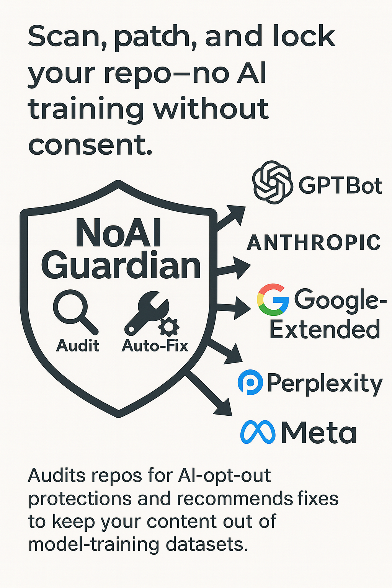

# NoAI Guardian – AI Opt-Out Compliance Action 🛡️  

**GitHub Action that scans your repository for missing AI-opt-out directives, then patches or proposes fixes so your content stays out of model-training datasets.**



---

## ✨ What it does

| Capability | Details |
|------------|---------|
| **Audit**  | Scans every HTML file for `<meta name="robots" content="noai, noimageai">` and checks `robots.txt` for blocks on GPTBot, Google-Extended, ClaudeBot, Perplexity, CCBot, aiCrawler … |
| **Auto-Fix** <br>*(opt-in)* | Injects the meta tag after `<head>` and adds any missing crawler rules to `robots.txt`, then stages changes with `git add .`. |
| **Actionable report** | Job Summary prints a table—**File ▸ Status ▸ Reason ▸ Fix (what & where)**—so you can copy-paste the snippet or merge the auto-PR. |
| **CI gate** | Workflow fails if violations remain, protecting future commits. |

### 📋 Sample Job-Summary output

| File        | Status | Reason                                   | Fix (what & where) |
|-------------|--------|------------------------------------------|--------------------|
| robots.txt  | ❌ Fail | missing bot rule(s): GPTBot, ClaudeBot   | Add to **/robots.txt**:<br>`User-agent: GPTBot`<br>`Disallow: /`<br>`User-agent: ClaudeBot`<br>`Disallow: /` |
| index.html  | ❌ Fail | meta tag missing                         | Insert inside `<head>` of **index.html**:<br>`<meta name="robots" content="noai, noimageai">` |
| about.html  | ✅ Pass | —                                        | — |

*(If `fix: true`, these edits are applied automatically and pushed via an auto-PR.)*

---

## 🚀 Quick start

```yaml
name: AI Opt-Out CI
on: [push]

jobs:
  guard:
    runs-on: ubuntu-latest
    steps:
      - uses: actions/checkout@v4

      # Audit only (fails build when violations exist)
      - uses: rahulrao/noai-guardian-action@v0.1.0
        with:
          path: '.'

      # Audit + auto-fix + open PR  (recommended)
      - uses: rahulrao/noai-guardian-action@v0.1.0
        id: guard
        with:
          path: '.'
          fix: 'true'

      - uses: peter-evans/create-pull-request@v5
        if: failure()                     # runs only when Guardian finds problems
        with:
          branch: noai/fixes
          title: 'AI opt-out compliance fixes'
```

---

## 🔧 Inputs

| Input | Default | Description |
|-------|---------|-------------|
| `path` | `.`     | Folder to scan (relative to repo root) |
| `fix`  | `false` | `true` ⇒ auto-patch violations and `git add` changes |

---

## 🛠️ Local test

```bash
docker build -t noai-guardian .
docker run --rm -v "$PWD":/repo -w /repo noai-guardian --path . --fix
```

---

## 🗺️ Roadmap

| Version | Planned feature |
|---------|-----------------|
| **v0.2** | TinyLlama on-runner for context-aware diffs |
| **v0.3** | Nightly monitoring + Slack/email alerts |
| **v0.4** | Cloudflare Worker “edge injector” for locked-down CMSs |

---
